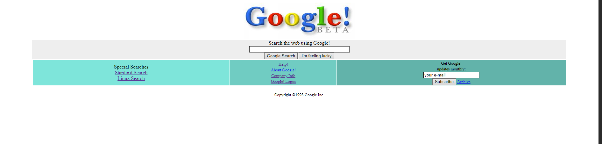

<h1>Google Beta Ana Sayfası</h1>

Google 1996 yılında kuruldu ve ilk versiyonunu 1998 yılında yayınladı. Wayback Machine adındaki web arşivi sayesinde Google'ın 1998 yılında nasıl göründüğünü biliyoruz. ([Google 1998](https://web.archive.org/web/19981202230410if_/http://www.google.com/))

Ben de şu ana kadar öğrendiklerime dayanarak bu siteyi HTML ve CSS kullanarak yapmaya çalıştım:

<ul>
    <li>Butonlar ve input alanları şuan için çalışmamakta. Öğrenme sürecimde kaydettiğim ilerleme doğrultusunda Google Beta'da düzenleme ve günümüzde kullanılan Google ana sayfasını yapacağım.</li>
</ul>
